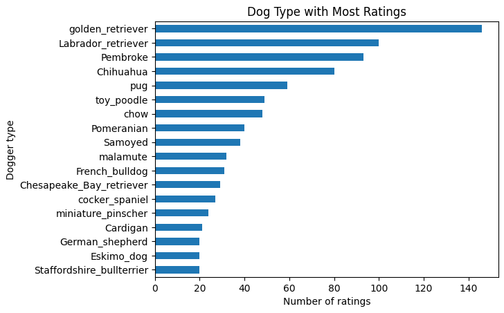

# Analysis of Tweets for [WeRateDogs](https://twitter.com/dog_rates)
Data wrangling WeRateDogs Twitter data to create interesting analyses and visualizations.

## Project Overview
Using Python and its libraries, I gathered data from a variety of sources and in a variety of formats, assessed its quality and tidiness, then cleaned it. WeRateDogs is a Twitter account that rates people's dogs with a humorous comment about the dog. These ratings almost always have a denominator of 10. The numerators, though? Almost always greater than 10. 11/10, 12/10, 13/10, etc. Why? Because "[they're good dogs Brent](https://knowyourmeme.com/memes/theyre-good-dogs-brent)." WeRateDogs has over 4 million followers and has received international media coverage.

## Project Motivation
Questions to be answered by the analysis:
- Which dogger type has the most ratings?
- Do Chihuahua or German Shepherd have more ratings?
- Do Chihuahua or German Shepherd have a higher average rating?

## Technology Used
- Anaconda
- Jupyter Notebook
- Python
- pandas
- NumPy
- Matplotlib
- Seaborn
- Pillow
- requests
- json

### Gathering Data
In this project, I worked on the following three datasets. All datasets are in the `data` folder.

__Enhanced Twitter Archive__
The `twitter-archive-enhanced.csv` file contains a historical archive of tweets. This archive was provided by the WeRateDogs account and then Udacity enhanched the file by pulling out the ratings, dog names, and dog_stage variable. This file was downloaded manually from Udacity.

__Additional Data via the Twitter API__
The `tweet-json.txt` file was provided by Udacity since Twitter has changed their API. This file was hosted on Udacity's servers and downloaded programmatically using the Request library.

__Image Predictions File__
The `image-predictions.tsv` file contains the results of running every image from the WeRateDogs Twitter archive through a neural network that can classify breeds of dogs. This file was hosted on Udacity's servers and downloaded programmatically using the Requests library.

### Assessing and Cleaning Data
For this project the following issues had to be assessed:

- Only keep original ratings (no retweets) that have images.
- Assess and clean at least 8 quality issues and at least 2 tidiness issues in this dataset.
- The fact that the rating numerators are greater than the denominators does not need to be cleaned. This [unique rating system](http://knowyourmeme.com/memes/theyre-good-dogs-brent) is a big part of the popularity of WeRateDogs.
- No need to gather tweets beyond August 1st, 2017 since I wouldn't be able to gather the image predictions for those tweets.

#### Assessing and Cleaning `twitter-archive-enhanced.csv`
- Visual assessment of the data was performed both within `wrangle_act.ipynb` and in Excel.
- Programmatic assessment was performed within the `wrangle_act.ipynd`.
- A copy of the data was created before cleaning was performed.

##### Quality and Tidiness Issues
- Incorrect `name` values were replaced with NaN values.
- `tweet_id` was converted to string format since it represented the end of the URL of a tweet.
- `timestamp` was converted to datetime.
- Tweets that were replies or retweets were removed from the dataset.
- All `rating_denominator` values were changed to 10.
- All `rating_numerator` values greater than 14 were either adjusted or removed from the dataset.
- For `rating_numerator` values less than 6, each tweet was inspected manually to determine if the image was of a dog or if the rating had to be adjusted. Images that were not dogs were removed from the dataset.
- For `rating_numerator` values that were given as decimals in the tweet were rounded up to the nearest whole number.
- Tweets that had null `expanded_urls` values were removed from the dataset.
- The `dog_stage` column was created and the individual columns for doggo, puppo, pupper, floofer were removed after their respective values were moved to the `dog_stage` column.
- Columns that were not needed for analysis were removed (`source`, `expanded_urls`).

#### Assessing and Cleaning `image-predicitions.tsv`
- Visual assessment of the data was performed both within `wrangle_act.ipynb` and in Excel.
- Programmatic assessment was performed within the `wrangle_act.ipynd`.
- A copy of the data was created before cleaning was performed.

##### Quality and Tidiness Issues
- `tweet_id` was converted to string format since it represented the end of the URL of a tweet and would enable this dataset to be merged.
- For rows that had duplicated values in the `jpg_url` column were removed. I removed the last instance since this was the retweet of an original tweet.
- The `dogger_prediction_type` column was created to keep either the most confident prediction (dog breed or not) or one of the predictions that was a dog breed, or the first prediction if no breed was detected.
- The `dogger_prediction_confidence` column was created to keep the confidence interval for the `dogger_predicition_type` column.
- All other columns relating to predicitions was removed from the dataset.

#### Assessing and Cleaning `tweet-json.txt`
- Visual assessment of the data was performed both within `wrangle_act.ipynb` and in Excel.
- Programmatic assessment was performed within the `wrangle_act.ipynd`.
- A copy of the data was created before cleaning was performed.

##### Quality and Tidiness Issues
- No issues were addressed with this dataset since it was already complete and in the correct formats.

#### Storing Data
All the cleaned datasets were merged together and this new dataset was saved as `twitter_archive_master.csv` in the `data` folder.

## Conclusions

#### Insights
 > _These dog types were determined by the image recognition algorithm and these results have not been confirmed to be accurate._

##### Which dogger type have the most ratings?

Golden retriever and Labrador retriever dog types make up the majority of the posts.

##### Do Chihuahua or German Shepherd have more ratings?

Chihuahua have more ratings than German Shepherd. The range of ratings for Chihuahua is more widespread than ratings for German Shepherd.

##### Do Chihuahua or German Shepherd have a higher average rating?

The average rating for a Chihuahua is 10.79. The average rating for a German Shepherd is 10.95.

## Resources
[Blog post](https://saturncloud.io/blog/how-to-show-images-in-jupyter-notebook/) by Saturn Cloud for showing images in Jupyter Notebook

[Pillow documentation](https://pillow.readthedocs.io/en/stable/reference/Image.html#functions) for displaying images

## Extras

[Verified Certificate Of Completion](https://www.udacity.com/certificate/e/012b9870-af30-11ee-9078-6faba1e5b91d)
